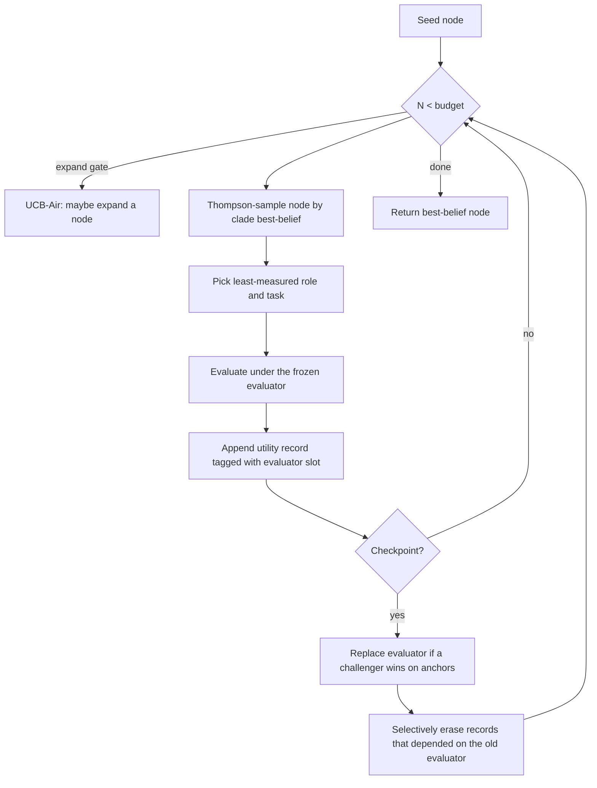

# Red Queen Gödel Machine (RQGM)

**Co-evolving agents and their evaluators.** A dependency-light Python
implementation of the search algorithm from
[*The Red Queen Gödel Machine: Co-Evolving Agents and Their Evaluators*](https://arxiv.org/abs/2606.26294)
(arXiv:2606.26294).

> **Disclaimer.** This is an independent, from-the-paper implementation for
> research and experimentation. It is not affiliated with or endorsed by the
> paper's authors.

RQGM extends archive-search self-improvement (the Darwin / Huxley Gödel Machine
line of work) by making the **evaluator itself part of the search**. The hard
problem with a moving objective is reward hacking and broken guarantees; RQGM's
answer is **controlled utility evolution**:

- Search proceeds in **epochs**; within an epoch every evaluator is **frozen**.
- Evaluators may only be **replaced at checkpoints**, and only by a challenger
  that scores higher on a **fixed ground-truth anchor set**.
- When an evaluator is replaced, the utility records that **depended on it** are
  **selectively erased** — so the next epoch's beliefs are clean, while
  evaluator-independent (anchor) records survive.

This preserves the per-epoch guarantees of fixed-criterion search while letting
the objective sharpen over time.

## Install

```bash
pip install red-queen-godel-machine          # zero-dependency core
pip install "red-queen-godel-machine[llm]"   # adds the OpenAI-compatible provider
```

The core has **no third-party dependencies**. Only the optional `llm` extra
pulls in `openai`.

## Quickstart (deterministic, no API key)

```python
from rqgm import run_rqgm, RQGMConfig

result = run_rqgm("mock", config=RQGMConfig(budget=128, seed=0))

print(result.best_node_id)        # best agent variant
print(round(result.best_belief, 3))
print(result.epochs)              # {0: 3}  -> slot 0 went through 3 epochs
for rep in result.replacements:   # evaluator replacements + records erased
    print(rep.from_id, "->", rep.to_id, "erased", rep.erased)
```

Or from the command line:

```bash
rqgm search --provider mock --budget 128 --seed 0
rqgm search --provider mock --budget 128 --seed 0 --json --out runs/rqgm
rqgm inspect <run_id> --root runs/rqgm
```

## How it works



The mechanisms, each in one line:

- **Best-belief score** (`rqgm.beta.best_belief`): `BB_ε = I⁻¹_ε(1+S, 1+F)`, the
  ε-quantile of the `Beta(1+S, 1+F)` posterior — a conservative lower bound that
  rewards evidence. Used for both node selection and evaluator replacement.
- **Clade metaproductivity + Thompson sampling** (`rqgm.search`): nodes are
  sampled by drawing from their subtree's posterior, so productive lineages get
  more compute.
- **Three-level sampling**: node → least-measured role → least-measured task.
- **UCB-Air expansion gate**: expand only when `N^α ≥ |archive|`.
- **Exponential checkpoints**: replacement passes at `8, 16, 32, …, budget`,
  bounding reprocessing to `O(budget)`.
- **Anchor-based replacement** (`rqgm.providers.EvaluatorSlotProvider`): a frozen
  evaluator is replaced only by a challenger with a strictly higher anchor
  best-belief; ties keep the incumbent.
- **Selective erasure** (`rqgm.archive.Archive.erase_slot`): on replacement, drop
  exactly the records that depended on the displaced evaluator; anchor records
  (no evaluator dependency) always survive.

## Bring your own task

Wire RQGM to your domain by implementing two structural protocols (no subclassing
required — just match the method signatures):

```python
from rqgm import RQGMSearch, RQGMConfig, RoleSpec, EvaluatorCandidate

class MyWorkspace:               # rqgm.providers.WorkspaceProvider
    def roles(self): ...
    def seed(self): ...
    def expand(self, parent): ...                 # -> child workspace dict | None
    def evaluate(self, node, role, task, evaluator): ...   # -> 1 | 0

class MySlot:                    # rqgm.providers.EvaluatorSlotProvider
    slot = 0
    def incumbent(self): ...                      # -> EvaluatorCandidate
    def challengers(self, archive): ...           # -> list[EvaluatorCandidate]
    def anchor_outcomes(self, evaluator): ...     # -> (successes, failures)

result = RQGMSearch(MyWorkspace(), {0: MySlot()}, RQGMConfig(budget=256)).run()
```

See [`examples/custom_provider.py`](examples/custom_provider.py).

## LLM co-evolution (prompt evolution)

The shipped real provider evolves **prompts**: each node holds a coder prompt and
a reviewer (judge) prompt. The coder role is scored against verifiable answers;
the reviewer role is scored by the frozen judge's Accept/Reject verdict; the
meta-agent rewrites a prompt to expand the archive. Evaluators are grounded by a
labeled anchor set.

```python
from rqgm import run_rqgm, RQGMConfig, OpenAIChatModel, Sample, AnchorItem

model = OpenAIChatModel("gpt-4o-mini")  # any OpenAI-compatible endpoint
tasks = [Sample("q0", "2+2=", "4"), Sample("q1", "3*3=", "9")]
anchor = [AnchorItem("4", "Accept"), AnchorItem("five", "Reject")]

result = run_rqgm("llm", config=RQGMConfig(budget=64),
                  model=model, tasks=tasks, anchor=anchor)
```

See [`examples/llm_coevolution.py`](examples/llm_coevolution.py). It works against
OpenAI, OpenRouter, or any local OpenAI-compatible server via `base_url`.

## Limitations & safety

Straight from the paper, and worth repeating:

- **Guarantees are epoch-local.** Each epoch behaves like fixed-criterion search,
  but there is no global convergence guarantee across epochs.
- **Anchors are load-bearing.** Replacement quality is only as good as the anchor
  set. Weak or gameable anchors let a co-evolving evaluator drift — the
  reward-hacking frontier. Keep anchors fixed, adversarial, and grounded.
- **Binary outcomes only.** The ledger and scoring assume success/failure
  outcomes; richer reward signals must be thresholded.

## Project layout

| Module | Role |
| --- | --- |
| `rqgm.beta` | Beta best-belief (`BB_ε`) and posterior mean, pure stdlib |
| `rqgm.archive` | Utility-record ledger + selective erasure |
| `rqgm.providers` | `WorkspaceProvider` / `EvaluatorSlotProvider` protocols |
| `rqgm.search` | The RQGM search loop (Algorithm 1) |
| `rqgm.mock_providers` | Deterministic providers for tests/demos |
| `rqgm.llm_providers` | OpenAI-compatible prompt-evolution provider |
| `rqgm.runner` / `rqgm.cli` | Convenience runner + `rqgm` command |

A symbol-to-paper map lives in [`docs/paper-mapping.md`](docs/paper-mapping.md).

## Development

```bash
pip install -e ".[dev,llm]"
pytest -q
ruff check
```

## Citation

If you use this implementation, please cite the original paper (see
[`CITATION.cff`](CITATION.cff)).

## License

MIT — see [`LICENSE`](LICENSE).
